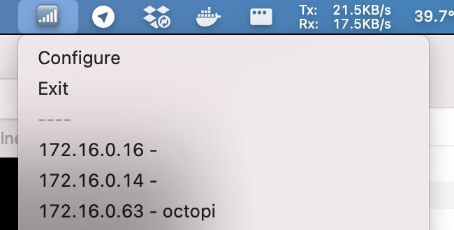

Creates a menu bar item to display IP addresses based on mikrotiks DHCP table. More of a proof of concept and a hope that someone will make something better

Checkout releases for precompiled versions